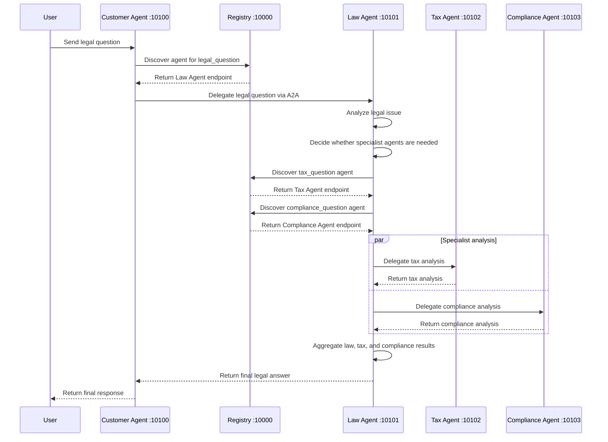

# Day 9 - Multi-Agent MCP / A2A Lab

## 1. Student Information

- Student name: Nguyen Van Chung
- Student ID: 2A202600647
- Course: AI20K - Day 9
- Lab: Multi-Agent MCP / A2A
- Repository: Batch02-Day9_Multi-Agent_MCP-A2A
- Model used: `openai/gpt-4o-mini` via OpenRouter
- Package manager: `uv`
- Operating system: Windows / PowerShell

---

## 2. Project Overview

This lab demonstrates the evolution from a direct LLM call to a distributed multi-agent system using A2A communication.

The project contains five main stages:

| Stage | Description |
|---|---|
| Stage 1 | Direct LLM call without tools or retrieval |
| Stage 2 | LLM with RAG/tools |
| Stage 3 | Single ReAct agent |
| Stage 4 | In-process multi-agent system |
| Stage 5 | Distributed A2A multi-agent system |

The final system contains multiple services:

| Service | Port | Role |
|---|---:|---|
| Registry | 10000 | Agent discovery |
| Customer Agent | 10100 | User-facing entry point |
| Law Agent | 10101 | Main legal analysis and orchestration |
| Tax Agent | 10102 | Tax-specific analysis |
| Compliance Agent | 10103 | Regulatory/compliance analysis |

---

## 3. Environment Setup

### 3.1 Install dependencies

```bash
uv sync
```

### 3.2 Configure environment

Create `.env` from `.env.example`:

```bash
copy .env.example .env
```

Example `.env`:

```env
OPENROUTER_API_KEY=sk-or-v1-xxxxxxxxxxxxxxxx
OPENROUTER_MODEL=openai/gpt-4o-mini
REGISTRY_URL=http://localhost:10000
```

I used `openai/gpt-4o-mini` because it is stable enough for tool calling, ReAct agents, and multi-agent orchestration while keeping cost low.

---

## 4. Stage Execution Results

### 4.1 Stage 1 - Direct LLM Calling

Command:

```bash
uv run python stages/stage_1_direct_llm/main.py
```

Status: Completed successfully.

Evidence:

```text
STAGE 1: Direct LLM Calling

Question:
What are the legal consequences if a company breaches a non-disclosure agreement?

>>> Calling LLM directly (no tools, no RAG)...

The system returned an answer about NDA breach consequences, including:
- Injunctive relief
- Monetary damages
- Liquidated damages
- Attorney fees
- Reputational damage
```

Observation:

Stage 1 worked, but it was limited because the LLM answered only from its internal knowledge. There were no tools, no retrieval, and no external grounding.

---

### 4.2 Stage 2 - LLM + RAG / Tools

Command:

```bash
uv run python stages/stage_2_rag_tools/main.py
```

Status: Completed successfully.

Evidence:

```text
STAGE 2: LLM + RAG / Tools

Tool: search_legal_database
Args: {'query': 'legal consequences of breach of non-disclosure agreement NDA'}
Result: [nda_trade_secret] NDA breaches may trigger both contractual and statutory liability...
```

Observation:

Stage 2 improved Stage 1 by allowing the LLM to call `search_legal_database`. The final answer became more grounded because it included retrieved legal information such as DTSA-related consequences.

---

### 4.3 Stage 3 - Single ReAct Agent

Command:

```bash
uv run python stages/stage_3_single_agent/main.py
```

Status: Completed successfully.

Evidence:

```text
STAGE 3: Single Agent (ReAct Loop)

Tool calls:
- search_legal_database
- search_legal_database
- check_compliance_requirements
- calculate_penalty
- calculate_penalty
```

Observation:

The ReAct agent was able to break down a complex question into multiple tool calls. It searched legal information, checked compliance requirements, and calculated penalties before producing a final answer.

---

### 4.4 Stage 4 - Multi-Agent System In-Process

Command:

```bash
uv run python stages/stage_4_milti_agent/main.py
```

Status: Completed successfully after retry.

Evidence:

```text
STAGE 4: Multi-Agent System (In-Process)

[Node: analyze_law] Done
[Node: check_routing] needs_tax=True, needs_compliance=True
[Node: call_tax_specialist] Done
[Node: call_compliance_specialist] Done
[Node: aggregate] Done

FINAL ANSWER
```

Observation:

Stage 4 split the task into specialist agents. The law agent analyzed the legal issue, then routed to tax and compliance specialists in parallel before aggregating the final response.

Note:

The first run encountered an OpenRouter `429` rate-limit error. A later retry succeeded. This was an API quota/provider issue, not a logic error in the graph.

---

### 4.5 Stage 5 - Distributed A2A Multi-Agent System

Commands used to start services:

```bash
uv run python -m registry
uv run python -m law_agent
uv run python -m tax_agent
uv run python -m compliance_agent
uv run python -m customer_agent
```

Client command:

```bash
uv run python test_client.py
```

Status: Completed successfully.

Evidence:

```text
Connecting to Customer Agent at http://localhost:10100
Question: If a company breaks a contract and avoids taxes, what are the legal and regulatory consequences?
------------------------------------------------------------
Connected to agent: Customer Agent v1.0.0
------------------------------------------------------------
Sending request (this may take 30-60s while agents chain)...

RESPONSE:
The system returned a complete legal and regulatory analysis.
```

Observation:

The distributed A2A system successfully accepted the user request through the Customer Agent and returned a final legal response.

---

## 5. Exercise 2 - Tools and Knowledge Base

### 5.1 Requirement

Exercise 2 required:

1. Adding a new `labor_law` entry to the legal knowledge base.
2. Creating a new tool named `check_statute_of_limitations`.
3. Binding the new tool to the LLM.
4. Testing the tool call.

### 5.2 Implementation Summary

File modified:

```text
exercises/exercise_2_tools.py
```

Changes made:

- Added `labor_law` to `LEGAL_KNOWLEDGE`.
- Implemented `check_statute_of_limitations(case_type: str)`.
- Added the new tool to the tool list.
- Added handling logic for the new tool call.

### 5.3 Test Command

```bash
uv run python exercises/exercise_2_tools.py
```

### 5.4 Evidence

```text
Câu hỏi: Thời hiệu khởi kiện vụ vi phạm hợp đồng là bao lâu?

🔧 Gọi tool: check_statute_of_limitations

✅ Kết quả:
Theo quy định của pháp luật, thời hiệu khởi kiện đối với các vụ vi phạm hợp đồng thường là 4 năm.
```

Conclusion:

Exercise 2 was completed successfully. The LLM correctly called the new statute-of-limitations tool.

---

## 6. Exercise 4 - Multi-Agent System with Privacy Agent

### 6.1 Requirement

Exercise 4 required:

1. Adding a new `privacy_agent`.
2. Adding routing keywords such as `data`, `privacy`, `gdpr`, `dữ liệu`, and `rò rỉ`.
3. Adding the privacy node to the graph.
4. Connecting the privacy agent to the aggregation step.
5. Testing with a data breach question.

### 6.2 Implementation Summary

File modified:

```text
exercises/exercise_4_multiagent.py
```

Changes made:

- Implemented `privacy_agent`.
- Added privacy-related routing keywords.
- Added `privacy_agent` as a LangGraph node.
- Added edge from `privacy_agent` to `aggregate_results`.
- Added `privacy_analysis` into the final response.
- Fixed LangGraph conditional routing so `check_routing` is used as a routing function instead of a normal node.

### 6.3 Important Bug Fix

Initial error:

```text
InvalidUpdateError: Expected dict, got [Send(...), Send(...)]
During task with name 'check_routing'
```

Cause:

`check_routing` returned a list of `Send(...)` objects, but it was incorrectly used as a normal graph node. In LangGraph, normal nodes must return dictionaries. Routing functions can return `Send(...)`.

Fix:

`check_routing` was connected using `graph.add_conditional_edges(...)`.

### 6.4 Test Command

```bash
uv run python exercises/exercise_4_multiagent.py
```

### 6.5 Evidence

```text
MULTI-AGENT SYSTEM với Privacy Agent

Câu hỏi:
Nếu công ty bị rò rỉ dữ liệu khách hàng, hậu quả pháp lý và thuế là gì?

KẾT QUẢ CUỐI CÙNG
```

The final response included:

```text
II. Phân Tích Pháp Lý
III. Phân Tích Thuế
IV. Phân Tích Bảo Vệ Dữ Liệu
```

Privacy-specific output included:

```text
1. Nghĩa vụ bảo vệ dữ liệu
2. Nghĩa vụ thông báo khi có data breach
3. Rủi ro xử phạt theo GDPR hoặc quy định tương tự
4. Biện pháp giảm thiểu rủi ro
```

Conclusion:

Exercise 4 was completed successfully. The graph routed the data breach question to the privacy and tax agents and aggregated the final result.

---

## 7. Stage 5 Trace Request Flow

### 7.1 Text Trace

The request flow in Stage 5 is:

```text
User
  ↓
Customer Agent :10100
  ↓
Registry :10000
  ↓
Law Agent :10101
  ↓
Registry :10000
  ↓
Tax Agent :10102
  ↓
Compliance Agent :10103
  ↓
Law Agent aggregates specialist results
  ↓
Customer Agent returns the final answer to User
```

### 7.2 Sequence Diagram



### 7.3 Evidence

```text
Connecting to Customer Agent at http://localhost:10100
Connected to agent: Customer Agent v1.0.0
Sending request (this may take 30-60s while agents chain)...

RESPONSE:
The system returned a final legal and regulatory analysis.
```

Conclusion:

Stage 5 successfully demonstrated a distributed A2A request flow from the Customer Agent to the Law Agent and specialist agents.

---

## 8. Dynamic Discovery / Tax Agent Stopped Test

### 8.1 Test Purpose

This test checks what happens when a specialist agent is unavailable.

### 8.2 Test Procedure

Steps:

```text
1. Start Registry, Law Agent, Compliance Agent, and Customer Agent.
2. Stop Tax Agent using Ctrl+C.
3. Run the client again:
   uv run python test_client.py
4. Observe whether the system still returns a response.
```

### 8.3 Evidence

Tax Agent was stopped, then the client was run again:

```text
Connecting to Customer Agent at http://localhost:10100
Question: If a company breaks a contract and avoids taxes, what are the legal and regulatory consequences?
------------------------------------------------------------
Connected to agent: Customer Agent v1.0.0
------------------------------------------------------------
Sending request (this may take 30-60s while agents chain)...

LATENCY_SECONDS=52.89

RESPONSE:
The system returned a legal and regulatory response.
```

The response still covered:

```text
- Breach of contract consequences
- Tax evasion consequences
- Regulatory compliance
- Liability exposure
- Mitigating factors
- Cross-border implications
```

### 8.4 Observation

Even when the Tax Agent was stopped, the Customer Agent still accepted the request and returned a response. From the user-facing perspective, the system did not crash.

However, the final response still contained general tax-related analysis. This means the Law Agent or the remaining orchestration path was still able to produce a general tax discussion. To prove the exact specialist failure path, Law Agent server logs should also be captured.

### 8.5 Conclusion

The dynamic discovery / fault-tolerance test was partially successful:

- The distributed system did not crash when Tax Agent was stopped.
- The Customer Agent still returned a final response.
- The answer still contained useful legal and tax-related information.
- Additional Law Agent logs would be useful to show the exact failed delegation or fallback behavior.

---

## 9. Modified Tax Agent Behavior

### 9.1 Requirement

The codelab asks students to modify the Tax Agent behavior.

### 9.2 File Modified

```text
tax_agent/graph.py
```

### 9.3 Change Summary

The Tax Agent prompt was modified so that it becomes more specialized and concise.

New behavior:

```text
- Focus only on tax consequences.
- Avoid repeating general contract-law analysis.
- Use concise bullet points.
- Include civil penalties, criminal penalties, IRS/regulatory scrutiny, and mitigation.
- End with a short educational disclaimer.
```

### 9.4 Reason for Change

The original Tax Agent could produce long answers that overlapped with the Law Agent and Compliance Agent. The modified behavior makes the Tax Agent more focused, which improves the quality of the final aggregation.

### 9.5 Evidence from Final Response

The Stage 5 output contained a tax-focused section:

```text
Tax Evasion Consequences

- Criminal Charges: Tax evasion is classified as a felony, leading to significant legal consequences.
- Civil Penalties: Civil penalties can be imposed by the IRS and may accumulate beyond the owed taxes.
```

Conclusion:

The Tax Agent behavior was modified to provide a more focused tax analysis suitable for multi-agent aggregation.

---

## 10. Latency Measurement and Optimization

### 10.1 Latency Measurement Implementation

File modified:

```text
test_client.py
```

Change made:

`time.perf_counter()` was added to measure total request-response time.

The client now prints:

```text
LATENCY_SECONDS=xx.xx
```

### 10.2 Test Command

```bash
uv run python test_client.py
```

### 10.3 Latency Results

| Run | Latency |
|---|---:|
| 1 | 65.60s |
| 2 | 86.87s |
| 3 | 48.84s |
| Average | 67.10s |

Average calculation:

```text
(65.60 + 86.87 + 48.84) / 3 = 67.10 seconds
```

### 10.4 Additional Tax-Agent-Off Run

| Scenario | Latency |
|---|---:|
| Tax Agent stopped | 52.89s |

### 10.5 Observation

The latency varied significantly between runs. This is expected because Stage 5 is a distributed system with multiple agents, HTTP calls, and multiple LLM calls. Model response time and network conditions can affect total runtime.

### 10.6 Optimization Applied

File modified:

```text
law_agent/graph.py
```

Optimization:

The Law Agent routing step was changed from LLM-based routing to deterministic keyword routing.

Before optimization:

```text
The Law Agent called the LLM to decide whether Tax Agent and Compliance Agent were needed.
```

After optimization:

```text
The Law Agent checks keywords such as:
- tax
- taxes
- IRS
- compliance
- SEC
- SOX
- AML
- regulation
- governance
```

If relevant keywords are found, the Law Agent routes directly to specialist agents without an extra LLM call.

### 10.7 Why This Helps

LLM calls are usually the slowest part of the system. Removing one model call from the routing step can reduce latency and make routing more predictable.

### 10.8 Trade-Off

Keyword routing is faster and more predictable, but it is less flexible than LLM routing for ambiguous questions.

For this lab, the trade-off is acceptable because the test question clearly contains tax and compliance-related keywords.

Conclusion:

Latency measurement was implemented successfully, and an optimization strategy was applied and explained.

---

## 11. Known Warnings and Issues

### 11.1 A2AClient Deprecation Warning

Observed warning:

```text
DeprecationWarning: A2AClient is deprecated and will be removed in a future version.
Use ClientFactory to create a client with a JSON-RPC transport.
```

Explanation:

This is a library deprecation warning. It does not break the lab execution.

### 11.2 OpenRouter Rate Limit

Observed issue:

```text
openai.RateLimitError: Error code: 429
Rate limit exceeded: free-models-per-day
```

Explanation:

This was caused by OpenRouter free-model quota limits. It was resolved by retrying later and using `openai/gpt-4o-mini`.

### 11.3 Stage 4 Folder Name

The Stage 4 folder in this repository is named:

```text
stage_4_milti_agent
```

Therefore, the command used was:

```bash
uv run python stages/stage_4_milti_agent/main.py
```

---

## 12. Final Completion Checklist

| Requirement | Status |
|---|---|
| Stage 1 direct LLM | Completed |
| Stage 2 RAG/tools | Completed |
| Stage 3 ReAct agent | Completed |
| Stage 4 in-process multi-agent | Completed |
| Stage 5 distributed A2A | Completed |
| Exercise 2 knowledge base update | Completed |
| Exercise 2 statute-of-limitations tool | Completed |
| Exercise 4 privacy agent | Completed |
| Exercise 4 conditional routing | Completed |
| Stage 5 trace request flow | Completed |
| Stage 5 sequence diagram | Completed |
| Dynamic discovery / Tax Agent stopped test | Completed |
| Modified Tax Agent behavior | Completed |
| Latency measurement | Completed |
| Latency optimization explanation | Completed |

---

## 13. Reflection

This lab helped me understand the progression from a simple LLM application to a distributed multi-agent system.

Key learnings:

1. Direct LLM calls are simple but not grounded.
2. Tool calling improves reliability by allowing the LLM to use external functions.
3. ReAct agents can perform multi-step reasoning and tool usage.
4. Multi-agent systems improve specialization by assigning different roles to different agents.
5. A2A allows agents to run as independent services and communicate through a distributed protocol.
6. Registry-based discovery makes the architecture more flexible than hard-coded service calls.
7. Distributed systems require better error handling because one specialist agent may be unavailable.
8. Latency becomes a real concern when multiple agents and multiple LLM calls are chained together.

Overall, the lab demonstrates why multi-agent systems are useful for complex workflows, but also shows the importance of routing, observability, fallback handling, and latency optimization.
